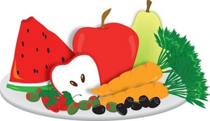

.. Cozmo Build a Plate Game documentation master file, created by
   sphinx-quickstart on Sun Apr  1 14:27:34 2018.
   You can adapt this file completely to your liking, but it should at least
   contain the root `toctree` directive.

.. |br| raw:: html

    

|br|

Cozmo Taste Game Documentation
======================================

Welcome to the programmer's documentation website for the Cozmo Taste Game!
The Cozmo Taste Game is a game intended for children who are aged 3 - 6. The goal
of the game is for children to pick the food that matches the food group that Cozmo says. For more information about the game
and how it is played, please click the following button to download the user's guide.

See user's guide:  https://docs.google.com/document/d/1LqF_U3-tHvY6XhqdeqVIEKbY_tAriUCiIkS9gHQ1OGg/edit

Please review the Setup page under Getting Started for instructions on how to get
setup to start developing the Cozmo Taste project.

For more detailed information about the various packages, modules, and functions used throughout the Cozmo Taste Game
program please see the various links under API.

For information about how this documentation website was built and how to maintain it visit
Documentation under About.

.. toctree::
   :maxdepth: 2
   :caption: Getting Started

   pages/setup
   pages/basic_program_flow

.. toctree::
   :maxdepth: 2
   :caption: API

   cozmo_taste_game/cozmo_taste_game

.. toctree::
   :maxdepth: 2
   :caption: Diagrams

   pages/class_diagrams

.. toctree::
   :maxdepth: 2
   :caption: Image Recognition

   pages/how_to_train

.. toctree::
   :maxdepth: 2
   :caption: About

   pages/documentation
   pages/credits

Indices and tables
==================

* :ref:`genindex`
* :ref:`modindex`
* :ref:`search`
